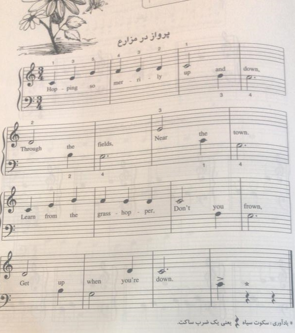

# Note Player (Digital signal processing final project)

This MATLAB project generates an audio file from a sequence of musical notes and displays a spectrogram of the generated audio. The notes are played with specified frequencies and durations, and an echo effect is added to enhance the sound.
- All signal processing techniques are based on [John G. Proakis's DSP Book](https://elibrary.pearson.de/book/99.150005/9781292038162).
- This was my project for the DSP LAB in March 2020.
- Each note (each single tone) is based on the piano middle octave, with some conventions.
- The note I've used is a simple piece for naive piano players. Unfortunately, the only picture that I can reach is one that I've uploaded. You can apply each note based on the middle piano octave to the function according to your desire.
<div style="text-align: center;">
    
</div>

## Features

- Generate audio from a sequence of musical notes.
- Add echo effects to the audio.
- Display the spectrogram of the generated audio.
- Save the generated audio as a `.wav` file.

## Usage

1. **Place the `generateNoteAudio.m` file and the usage script (`RunMe.m` or your custom script) in the same directory.**

2. **Run `RunMe.m` or use the `generateNoteAudio` function.**

## Function Documentation

### `generateNoteAudio`

Generates an audio file from a sequence of musical notes.

#### Syntax

```matlab
generateNoteAudio(fs, duration, noteVect, noteDuration, outputFilename)
```

**noteVect** is based on the piano middle octave.


[Find me on LinkedIn](https://www.linkedin.com/in/omid-davoudnia-8b071a236)